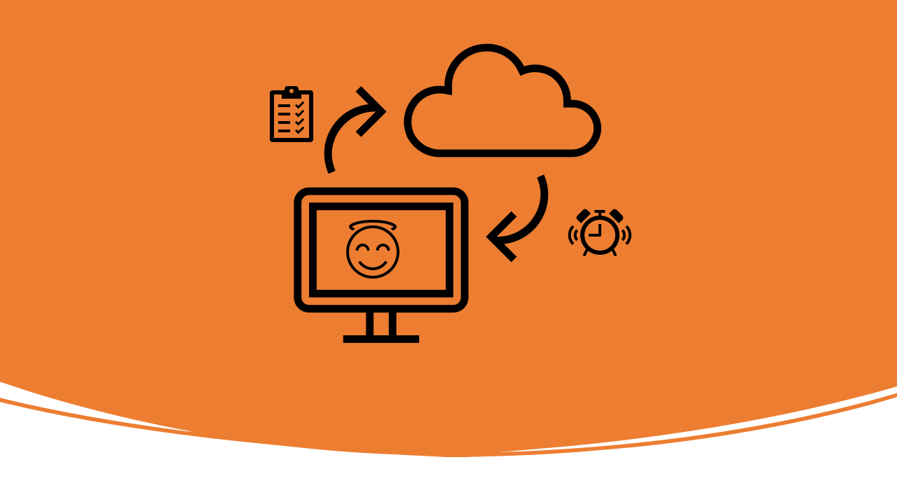

# Overview_RS

The To-Do service is a cloud-based platform that offers subscribers a task list
where they can post tasks and receive timely reminders. Our service provides the REST
interface of a cutting-edge cloud-based task management platform. Thereby, delivering a seamless communication between users and their tasks.

## Key benefits

- No annual subscription required or maintenance cost.
- This service facilitates users to post and receive notifications through a secure and efficient channel.
- This service aims to enhance user productivity and task management efficiency.

## Get started

To use the To-Do API service, you will need a [GitHub account](https://github.com/), a system (PC, Mac,
or Linux), and [Postman](https://www.postman.com/downloads/) desktop application.
Check out the [First steps](https://uwc2-apidoc.github.io/to-do-service-public/tutorials/before-you-start-a-tutorial.html) tutorial to learn how to set up your
development system and test the service.
